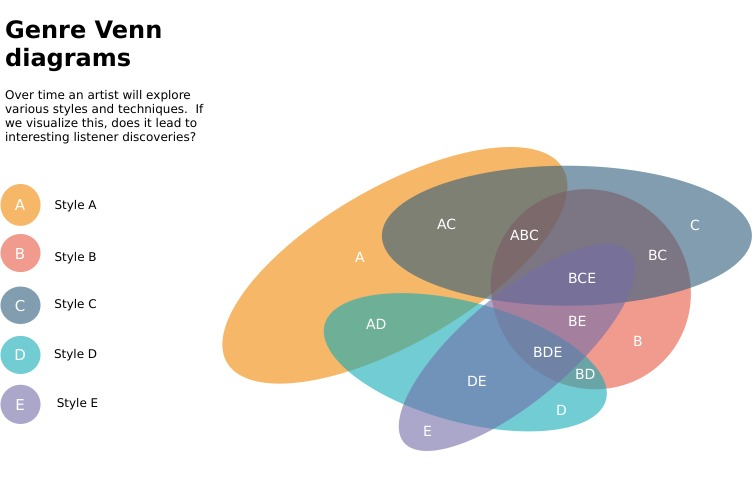
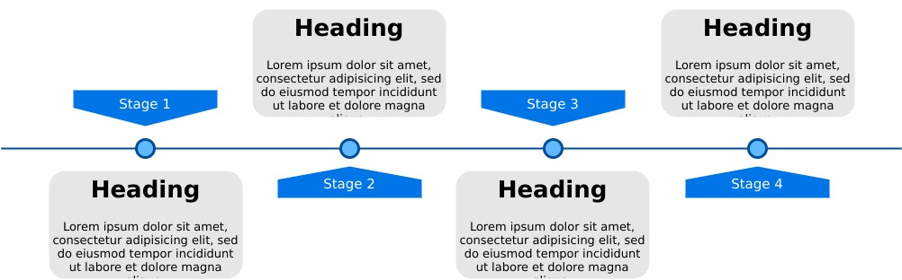

This is my fork of the awesome Musish ([musi.sh](https://musi.sh/)).  I forked it to test some interaction theories on music discovery.

## Quickstart

This repo requires `node` version `14`.  A great way to install & manage node runtimes on linux is [nvm](https://aur.archlinux.org/packages/nvm/).

### Install Packages
`yarn`

### Start dev server
`yarn start`

## Explorations

### Genre Venn Diagram

An artist will explore various genre's and techniques over the course of their work.  Does visualizing an artists stylistic footprint through the lens of composition of styles produce novel discovery patterns?

### Timeline discovery

The experience of any art is linked to the time and space you experience it in.  Music is particualarly bound by time as it's quite literally a temporal art form; your experience of music must occur over time.

Timelines are an obvious visualization of information with relation to time.

### Synesthesia

[While listening to music some people simeltanously experience the sensation of color.](https://en.wikipedia.org/wiki/Synesthesia).  Modern software interfaces don't explore cognitive shortcuts through use of color.  Does use of color in the interface improve discovery?